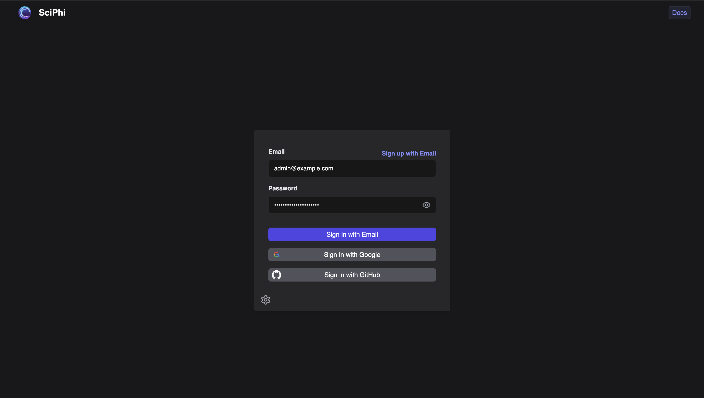
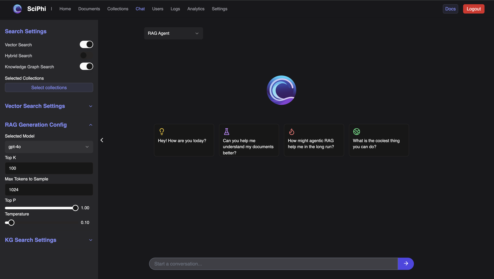
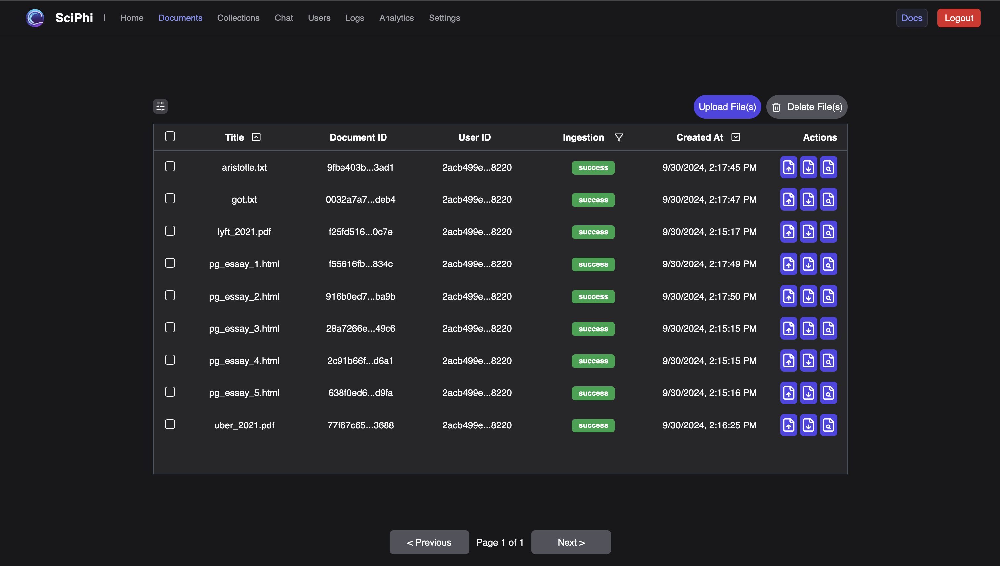
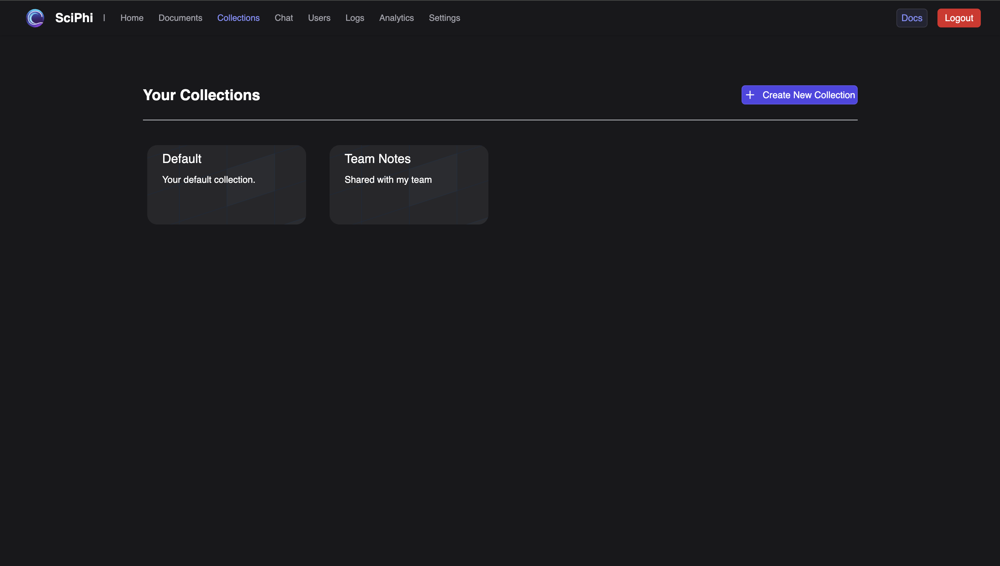

<h2 align="center">
R2R Dashboard
</h2>

<h3 align="center">
Manage and Monitor Your R2R RAG Applications with Ease
</h3>

# About

The R2R Dashboard is an open-source React+Next.js application designed to provide [R2R](https://github.com/SciPhi-AI/R2R) developers with an easy interface to interact with their pipelines. This dashboard aims to reduce development and iteration time by offering a user-friendly environment.

## Key Features

- **🗂️ Document Management**: Upload, update, and delete documents and their metadata.
- **🛝 Playground**: Stream RAG responses with different models and configurable settings.
- **📊 Analytics**: View aggregate statistics around latencies and metrics with detailed histograms.
- **📜 Logs**: Track user queries, search results, and LLM responses.
- **🔧 Development Tools**: Easily start a development server, format code, and run lint checks.

## Table of Contents

1. [Quick Install](#quick-install)
2. [Links](#links)
3. [Screenshots](#screenshots)
4. [Core Abstractions](#core-abstractions)
5. [Summary](#summary)

# Quick Install

### Install PNPM

PNPM is a fast, disk space-efficient package manager that helps you manage your project dependencies. To install PNPM, visit the [official PNPM installation page](https://pnpm.io/installation) for the latest instructions, or follow the instructions outlined below:

<details>
<summary>PNPM Installation</summary>

For Unix-based systems (Linux, macOS):

```bash
curl -fsSL https://get.pnpm.io/install.sh | sh -
```

For Windows:

```powershell
iwr https://get.pnpm.io/install.ps1 -useb | iex
```

After installing PNPM, you may need to add it to your system's PATH. Follow the instructions provided on the PNPM installation page to ensure it's properly set up.

</details>

### Clone the R2R Dashboard and Install Dependencies

1. **Clone the project repository and navigate to the project directory:**

   ```bash
   git clone git@github.com:SciPhi-AI/R2R-Application.git
   cd R2R-Application
   ```

2. **Install the project dependencies using PNPM:**

   ```bash
   pnpm install
   ```

3. **Build and start the application for production:**

   ```bash
   pnpm build
   pnpm start
   ```

This will build the application on port 3000. After `pnpm start` runs successfully, the dashboard can be viewed at [http://localhost:3000](http://localhost:3000).

### Developing with the R2R Dashboard

If you'd like to develop the R2R dashboard, you can do so by starting a development server:

1. **Start the development server:**

   ```bash
   pnpm dev
   ```

2. **Pre-commit checks (optional but recommended):**

   Ensure your code is properly formatted and free of linting issues before committing:

   ```bash
   pnpm format
   pnpm lint
   ```

# Links

- [Join the Discord server](https://discord.gg/p6KqD2kjtB)
- [R2R Docs Quickstart](https://r2r-docs.sciphi.ai/getting-started/quick-install)

## Docs

- [R2R Dashboard](https://r2r-docs.sciphi.ai/cookbooks/dashboard): A how-to guide on connecting with the R2R Dashboard.
- [R2R Demo](https://r2r-docs.sciphi.ai/getting-started/r2r-demo): A basic demo script designed to get you started with an R2R RAG application.
- [R2R Client-Server](https://r2r-docs.sciphi.ai/cookbooks/client-server): An extension of the basic `R2R Demo` with client-server interactions.
- [Local RAG](https://r2r-docs.sciphi.ai/cookbooks/local-rag): A quick cookbook demonstration of how to run R2R with local LLMs.
- [Hybrid Search](https://r2r-docs.sciphi.ai/cookbooks/hybrid-search): A brief introduction to running hybrid search with R2R.
- [Reranking](https://r2r-docs.sciphi.ai/cookbooks/rerank-search): A short guide on how to apply reranking to R2R results.
- [SciPhi Cloud Docs](https://docs.sciphi.ai/): SciPhi Cloud documentation.

# Screenshots






# Summary

The R2R Dashboard is a comprehensive tool designed to streamline the management and monitoring of Retrieval-Augmented Generation (RAG) pipelines built with the R2R framework. By providing a user-friendly interface and robust core features, the dashboard helps developers efficiently interact with their RAG systems, enhancing development and operational workflows.
